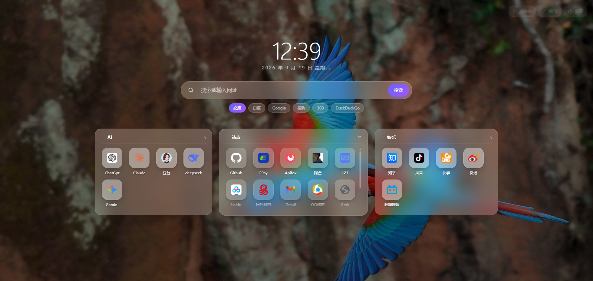
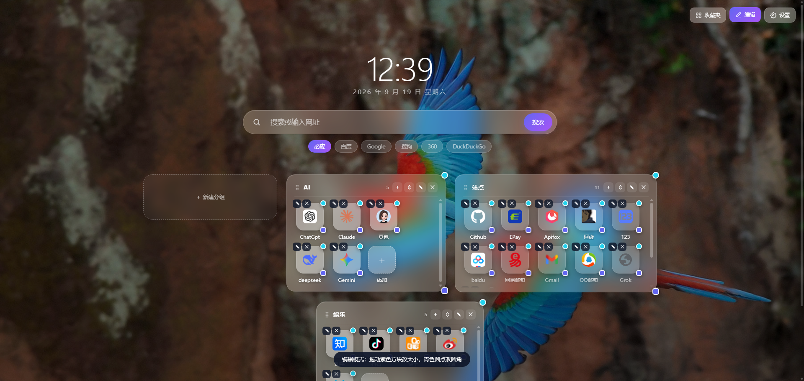
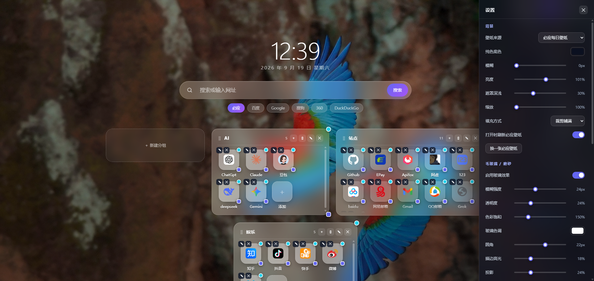
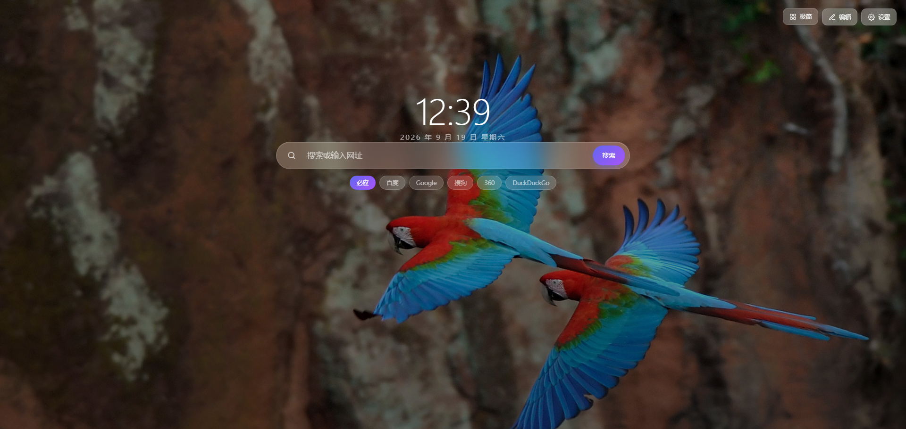

# 轻主页 · Lite New Tab

一个从零写的浏览器新标签页扩展（Manifest V3，Chrome / Edge / Brave 通用）。
两种模式、毛玻璃质感、分组与图标全部可视化拖拽调整。

---






## 一、安装（加载已解压的扩展）

1. 打开 `chrome://extensions/`（Edge 用 `edge://extensions/`）
2. 右上角打开 **开发者模式**
3. 点击 **加载已解压的扩展程序**，选择本文件夹 `browser-homepage`
4. 新开一个标签页即可看到

> 想直接看看效果又不想装扩展？双击 `newtab.html` 也能跑（数据存在 localStorage 里）。
> 只是那种情况下拿不到浏览器书签图标，会退化成首字母色块。

## 二、两种模式

| 模式 | 内容 | 切换方式 |
| --- | --- | --- |
| **收藏夹模式** | 时钟 + 搜索栏 + 分组图标墙 | `Ctrl + M` |
| **极简模式** | 只有搜索栏（可留时钟） | `Ctrl + M` |

右上角三个按钮在鼠标移开时会自动淡出，不打扰视线。

## 三、快捷键

| 键 | 作用 |
| --- | --- |
| `/` 或 `Ctrl + K` | 聚焦搜索栏 |
| `Ctrl + M` | 极简 / 收藏夹模式互切 |
| `Ctrl + E` | 开关编辑模式 |
| `Esc` | 关闭弹窗 / 设置面板 / 退出编辑模式 |
| 点击网址 | 当前标签打开 |
| `Ctrl/⌘ + 点击`、鼠标中键 | 新标签打开 |

搜索栏里直接输入域名（如 `github.com`）会直接跳转，输入其他内容则走选定的搜索引擎。

## 四、编辑模式（`Ctrl + E`）

开启后每个分组和图标上会出现两种拖拽手柄：

- 🟣 **紫色方块**（右下角）— 拖动调整**尺寸**。分组同时改宽高，图标保持正方形。
- 🔵 **青色圆点**（右上角）— 拖动调整**圆角**，从直角到正圆随便拉。
- 图标左上角 `✎` `✕` — 编辑 / 删除，点图标本身也能打开编辑框。
- 分组标题栏右侧 `＋` `✎` `✕` — 加网址 / 改分组名与颜色 / 删分组。
- **拖动图标**可以换位置，也可以拖到别的分组里；拖动分组标题左侧的 `⣿` 可以调整分组顺序。
- 编辑框里还能精确设置尺寸、圆角、背景不透明度和**底色**（底色留作默认值就跟随全局毛玻璃色调）。

拖动过程中会有一个浮层实时显示当前数值。

## 五、背景设置

「设置 → 背景」里可以调：

- **必应每日壁纸**（默认）：自动取当天壁纸的 UHD 版本，点「换一张」可以往前翻最近 8 天
- **图片链接**：粘贴任意图片地址
- **本地上传**：从电脑选图（存进扩展存储，建议 8MB 以内）
- **纯色 / 渐变**：用色板取色

外加 **模糊 / 亮度 / 遮罩深浅 / 缩放 / 填充方式（裁剪铺满、完整显示、平铺）**。

## 六、毛玻璃 / 磨砂

「设置 → 毛玻璃」里可以调 **模糊强度、透明度、色彩饱和、玻璃色调、圆角、描边高光、投影**，
并内置五个预设一键切换：

- **清透** — 几乎透明，只留一点点模糊
- **磨砂** — 默认的柔和 frosted 质感
- **亚克力** — 更厚的模糊 + 更实的底，接近 Windows Acrylic
- **液态** — 大模糊大圆角，接近 Apple 的 Liquid Glass
- **关闭** — 完全关掉玻璃效果，改用实色块

## 七、其它

- 配置可 **导出 / 导入 JSON**，方便备份或换机器
- 「清空全部收藏」和「恢复默认」都有二次确认
- 存储用 `chrome.storage.local`，配合 `unlimitedStorage` 权限，壁纸不会撑爆配额
- 图标走 Chrome 原生的 `_favicon` 接口（不联网、不外传 URL），取不到时退化为首字母色块

## 八、文件结构

```
browser-homepage/
├── manifest.json        MV3 清单，覆盖新标签页
├── newtab.html          页面结构 + 全部样式（CSS 变量由 JS 驱动）
├── app.js               全部逻辑：渲染 / 拖拽 / 设置 / 存储
└── icons/
    ├── make_icons.py    纯标准库生成图标的脚本（可重跑）
    ├── icon16.png
    ├── icon32.png
    ├── icon48.png
    └── icon128.png
```

改样式时基本只需要动 `newtab.html` 里 `:root` 的 CSS 变量名，
`app.js` 的 `applyTheme()` 会把用户设置写进这些变量。

## 九、已知限制

- `chrome://` 开头的页面、扩展商店页面上，图标取不到，会显示首字母色块，属正常现象
- 必应壁纸接口偶发失败时，会自动退回纯色背景并提示一次
- 玻璃效果依赖 `backdrop-filter`，浏览器需要在硬件加速开启的状态下才最流畅
